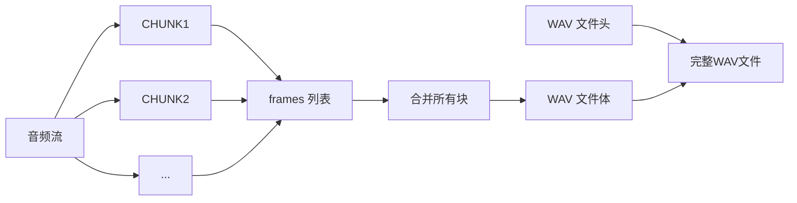

### pyaudio音频处理
---
*ask* ： 使用pyaudio进行音频处理时，经常见到的chunks、rate和frames是什么意思？请通俗地解释
在 PyAudio 中处理音频时，`chunks`、`rate` 和 `frames` 是三个核心概念，理解它们对处理音频流至关重要。我用通俗的比喻和解释帮你理清：

1.  **`rate` (采样率，Sample Rate)：**
    *   **通俗解释：** 想象你在用手机拍摄一段**快速旋转的风扇**。为了看清扇叶的运动，你需要**每秒拍很多张照片**。`rate` 就是**每秒对声音“拍照”的次数**。
    *   **技术含义：** 表示**每秒钟从麦克风（录音时）或向扬声器（播放时）采集或发送多少个声音样本**。单位是 **Hz（赫兹）**。
    *   **常见值：** 44100 Hz (CD 音质)、48000 Hz (常用音视频标准)、16000 Hz (电话语音)。
    *   **为什么重要？** 采样率决定了**音频能表示的最高频率**（根据奈奎斯特定理，最高频率是采样率的一半）。它也直接影响音频文件的**大小**和**质量**。更高的采样率通常意味着更好的音质（尤其是高频部分）和更大的文件。

2.  **`frames` (帧，Frame / Sample)：**
    *   **通俗解释：** 回到拍风扇的比喻。你拍下的**每一张单独的照片**就是一个`frame`（帧）。它记录了风扇在**那个瞬间**的精确状态。
    *   **技术含义：** 表示**在某个特定时间点采集到的一个声音样本值**。它本质上是一个**数字**，代表了麦克风振膜在那一刻的位置（或扬声器振膜需要移动到的位置）。
    *   **关键点：**
        *   一个 `frame` 通常对应**一个声道**的一个样本点。如果是**单声道**音频，一个 `frame` 就是一个数字。
        *   如果是**立体声**（两个声道），一个 `frame` 通常包含**两个数字**（左声道样本值 + 右声道样本值）。在 PyAudio 中，这两个数字会紧密地打包在一起（例如，左声道值紧接着右声道值）。
    *   **为什么重要？** `frames` 是构成数字音频的**最基本数据单元**。声音波形就是由成千上万个按时间顺序排列的 `frames`（样本值）描绘出来的。

3.  **`chunk` (数据块，Chunk / Buffer)：**
    *   **通俗解释：** 想象你拍风扇不是一张一张地处理照片，而是**每拍 10 张（或 100 张）就打包成一组**，然后一次性送去冲洗（处理）。这个“一组照片”就是一个 `chunk`。
    *   **技术含义：** 表示**一次从音频流中读取或写入的一组连续的 `frames` 的集合**。它是一个**二进制数据块**，包含了 `chunk_size` 个 `frames` 的数据。
    *   **关键点：**
        *   `chunk_size`： 这个参数**指定了一个 `chunk` 中包含多少个 `frames`**。例如 `chunk_size = 1024` 表示每次处理 1024 个样本点（对于单声道，就是 1024 个数字；对于立体声，就是 2048 个数字 - 1024 左 + 1024 右）。
    *   **为什么重要？**
        *   **实时性/流畅性：** 音频流是连续不断的。程序不能等到录完一整首歌才开始处理，也不能等一整首歌的数据都准备好才开始播放。`chunks` 允许程序**分段处理**音频数据，每次只处理一小块(`chunk`)，从而实现实时录音和播放，避免卡顿。
        *   **效率：** 一次读取/写入一小块数据通常比处理整个庞大的音频流更有效率，对 CPU 和内存更友好。
        *   **缓冲：** `chunks` 充当缓冲区，帮助协调数据生产（录音）和消费（处理或播放）之间的速度差异。

**总结与相互关系：**

1.  **`rate` 定节奏：** 它决定了时间尺度。每秒有 `rate` 个 `frames` 产生或消耗。
2.  **`frames` 是基础砖块：** 它们是构成声音波形的最小数据单元，每个 `frame` 代表一个时间点的声音强度（单声道）或多个声道的强度（立体声等）。
3.  **`chunks` 是搬运工：** 它们是程序实际读写音频流时使用的“包裹”。每个 `chunk` 包含固定数量 (`chunk_size`) 的 `frames`。程序不断地：录音时从麦克风流中“抓取”一个 `chunk` 的数据进行处理/保存；播放时向扬声器流“递送”一个 `chunk` 的数据让其发声。

**举个具体例子（录音）：**

*   你设置 `rate = 44100` (每秒采集 44100 个样本)。
*   你设置 `chunk_size = 1024` (每次处理 1024 个样本)。
*   程序开始录音：
    *   它第一次读取音频流，得到一个包含 **1024 个 `frames`** 的 `chunk` 数据（假设单声道，就是 1024 个数字）。
    *   这 1024 个样本代表了大约 **1024 / 44100 ≈ 0.023 秒** 的声音。
    *   你的程序可以对这个 `chunk` 的数据进行处理（比如保存到文件，或者分析音量）。
    *   然后它立刻去读取下一个 `chunk` (下一个 1024 个样本)，如此循环，直到停止录音。
*   最终，所有收集到的 `chunks` (每个包含 1024 个 `frames`) 拼接起来，就得到了完整的录音数据。

理解 `rate`、`frames` 和 `chunks` 是掌握 PyAudio 和实时音频处理的基础。它们共同定义了音频数据的时域分辨率、处理粒度以及数据流的方式。

---

# *ask* 如何使用pyaudio录制和播放音频？
使用 PyAudio 录制和播放音频需要理解音频流的基本操作。以下是详细步骤和代码示例：

### 核心概念回顾
- **采样率 (rate/sample_rate)**：每秒采集的音频样本数（如 44100 Hz）
- **帧 (frames)**：单个音频样本点（单声道）或多个声道的样本集合
- **块大小 (chunk_size)**：每次处理的数据块包含的帧数（如 1024 帧）
- **声道数 (channels)**：1=单声道，2=立体声
- **格式 (format)**：样本数据类型（如 `pyaudio.paInt16`）

---

### 一、录制音频并保存为 WAV 文件
```python
import pyaudio
import wave

# 录音参数
FORMAT = pyaudio.paInt16      # 16位整型
CHANNELS = 1                  # 单声道
RATE = 44100                  # 采样率
CHUNK = 1024                  # 块大小
RECORD_SECONDS = 5            # 录制时长
WAVE_OUTPUT_FILENAME = "output.wav"

# 初始化PyAudio
p = pyaudio.PyAudio()

# 打开音频流
stream = p.open(format=FORMAT,
                channels=CHANNELS,
                rate=RATE,
                input=True,    # 输入流（录音）
                frames_per_buffer=CHUNK)

print("开始录音...")

frames = []
for _ in range(0, int(RATE / CHUNK * RECORD_SECONDS)):
    data = stream.read(CHUNK)  # 读取音频块
    frames.append(data)        # 存储数据块

print("录音结束")

# 停止并关闭流
stream.stop_stream()
stream.close()
p.terminate()

# 保存为WAV文件
wf = wave.open(WAVE_OUTPUT_FILENAME, 'wb')
wf.setnchannels(CHANNELS)
wf.setsampwidth(p.get_sample_size(FORMAT))
wf.setframerate(RATE)
wf.writeframes(b''.join(frames))  # 合并所有数据块
wf.close()
```

---

### 二、播放音频文件（WAV格式）
```python
import pyaudio
import wave

def play_audio(filename):
    # 打开WAV文件
    wf = wave.open(filename, 'rb')
    
    # 初始化PyAudio
    p = pyaudio.PyAudio()
    
    # 打开输出流
    stream = p.open(format=p.get_format_from_width(wf.getsampwidth()),
                    channels=wf.getnchannels(),
                    rate=wf.getframerate(),
                    output=True)  # 输出流（播放）
    
    # 读取数据块并播放
    data = wf.readframes(CHUNK)
    while data:
        stream.write(data)      # 写入音频数据到输出流
        data = wf.readframes(CHUNK)
    
    # 清理资源
    stream.stop_stream()
    stream.close()
    p.terminate()

# 使用示例
play_audio("output.wav")
```

---

### 三、实时音频处理示例（回声效果）
```python
import pyaudio

# 音频参数
FORMAT = pyaudio.paInt16
CHANNELS = 1
RATE = 44100
CHUNK = 1024

p = pyaudio.PyAudio()

# 同时打开输入/输出流
stream = p.open(format=FORMAT,
                channels=CHANNELS,
                rate=RATE,
                input=True,
                output=True,  # 双工模式
                frames_per_buffer=CHUNK)

print("开启实时回声...按Ctrl+C停止")

try:
    while True:
        data = stream.read(CHUNK)   # 录音
        stream.write(data)          # 立即播放（产生回声）
except KeyboardInterrupt:
    print("停止")

stream.stop_stream()
stream.close()
p.terminate()
```

---

### 关键参数说明
| 参数              | 常见值                  | 说明                                                                 |
|-------------------|------------------------|----------------------------------------------------------------------|
| `format`          | `pyaudio.paInt16`      | 16位整数（CD音质标准）                                               |
| `channels`        | 1 或 2                 | 声道数（单声道/立体声）                                              |
| `rate`            | 44100, 48000, 16000    | 采样率（值越高音质越好）                                             |
| `frames_per_buffer` | 512, 1024, 2048       | 块大小（影响延迟和处理效率）                                         |
| `input/output`    | True/False             | 指定流方向（录音/播放）                                              |

---

### 常见问题解决
1. **权限错误**（Linux/Mac）：
   ```bash
   sudo apt-get install portaudio19-dev  # 安装依赖
   pip install pyaudio
   ```

2. **块大小选择**：
   - 较小的值（如 256）：延迟低，但CPU占用高
   - 较大的值（如 2048）：延迟高，但更稳定

3. **音频卡顿**：
   - 减少块大小
   - 降低采样率
   - 优化处理代码（避免耗时操作）

4. **立体声处理**：
   ```python
   # 立体声数据格式（左右声道交替存储）
   # [L0, R0, L1, R1, L2, R2, ...]
   stereo_data = np.frombuffer(data, dtype=np.int16)
   left_channel = stereo_data[0::2]   # 取奇数索引
   right_channel = stereo_data[1::2]  # 取偶数索引
   ```

> 提示：使用 `pyaudio.paFloat32` 格式配合 `numpy` 可以方便地进行音频信号处理（如FFT、滤波等）。

---

### 以下是我的问题：
### 1. Frames列表是什么？产生Frames列表的for循环次数是怎么计算的？
### 2. Frames列表里的数据格式是什么样的？
### 3. FROMAT参数是什么意思？
### 4. .wav格式的文件是怎么产生的？这和Frames列表有什么关系？

下面我将逐一解答你的问题，这些问题都是理解 PyAudio 音频处理的关键：

### 1. Frames 列表是什么？产生 Frames 列表的 for 循环次数是怎么计算的？

**Frames 列表**：
- 是一个存储音频数据块的 Python 列表
- 每个元素是一个二进制数据块（bytes 对象），包含固定数量的音频帧
- 在录音过程中逐步填充，最后合并形成完整的音频数据
> 其实就是存储的是数据块，也就是每一个元素就是一个chunk。所以for循环计算的就是n秒有多少个chunk

**for 循环次数计算**：
```python
循环次数 = int(RATE / CHUNK * RECORD_SECONDS)
```
- **RATE**：采样率（如 44100 Hz）
- **CHUNK**：每次读取的帧数（如 1024 帧）
- **RECORD_SECONDS**：要录制的秒数

**计算示例**：
```python
RATE = 44100, CHUNK = 1024, RECORD_SECONDS = 5
循环次数 = int(44100 / 1024 * 5) ≈ int(43.066 * 5) = int(215.33) = 215
```

**实际录音时长**：
```
实际时长 = (循环次数 × CHUNK) / RATE
         = (215 × 1024) / 44100 ≈ 4.99 秒
```
- 由于取整操作，实际时长会略小于目标时长
- 要精确录制，可以在循环后添加额外读取

### 2. Frames 列表里的数据格式是什么样的？

frames 列表中的每个元素都是**原始二进制数据**，具体格式取决于：

| 参数 | 影响 | 示例 |
|------|------|------|
| **FORMAT** | 每个样本的字节大小 | `paInt16` → 2字节/样本 |
| **CHANNELS** | 每帧的样本数 | 单声道→1样本/帧，立体声→2样本/帧 |
| **CHUNK** | 每个数据块的帧数 | 1024帧/块 |

**单声道示例**（FORMAT=paInt16, CHUNK=1024）：
- 每个数据块大小 = 1024帧 × 2字节/样本 × 1样本/帧 = **2048 字节**
- 数据内容：`b'\x12\x34\x56\x78...'`（2048个字节）

**立体声示例**（FORMAT=paInt16, CHUNK=1024）：
- 每帧包含左右2个声道样本
- 数据排列：[左0, 右0, 左1, 右1, ...]
- 块大小 = 1024帧 × 2样本/帧 × 2字节/样本 = **4096 字节**

**二进制数据的实际含义**：
```python
import struct

# 解码单个样本（paInt16）
sample_value = struct.unpack('<h', b'\x12\x34')[0]  # 小端序16位整数
# 值范围：-32768 到 32767，表示音频振幅
```

### 3. FORMAT 参数是什么意思？

FORMAT 指定了**音频样本的数据表示格式**，常见选项：

| 格式常量 | 说明 | 字节/样本 | 动态范围 |
|----------|------|-----------|----------|
| `paInt8` | 8位有符号整数 | 1字节 | -128 到 127 |
| `paInt16` | 16位有符号整数 | 2字节 | -32768 到 32767 |
| `paInt24` | 24位有符号整数 | 3字节 | -8,388,608 到 8,388,607 |
| `paFloat32` | 32位浮点数 | 4字节 | -1.0 到 1.0 |

**选择建议**：
- **语音处理**：`paInt16`（平衡大小和质量）
- **音乐处理**：`paInt24` 或 `paFloat32`（更高保真度）
- **深度学习**：`paFloat32`（适合神经网络输入）

**获取样本宽度**：
```python
sample_width = p.get_sample_size(FORMAT)
# 对于 paInt16 → 返回 2
```

### 4. .wav 格式的文件是怎么产生的？这和 Frames 列表有什么关系？

**.wav 文件生成过程**：
1. **创建文件头**：包含音频格式信息
   - 声道数（单声道/立体声）
   - 采样率（如 44100 Hz）
   - 样本宽度（字节数，如 16位→2字节）
   - 数据大小（总字节数）

2. **写入原始音频数据**：
   ```python
   wf.writeframes(b''.join(frames))
   ```
   - 将 frames 列表中的所有二进制块连接成连续字节流
   - 写入文件体部分

3. **添加文件尾**：完成标准的 WAV 文件结构

**frames 列表与 .wav 文件的关系**：


**关键点**：
1. frames 列表存储了**原始PCM音频数据**
2. .wav 文件 = **文件头** + **PCM数据**（来自frames） + **文件尾**
3. 文件头描述了如何解释后面的二进制数据
   - 设置错误的参数会导致播放异常（如设置单声道播放立体声）

**验证方法**：
```python
# 检查写入的WAV文件
import wave
wf = wave.open('output.wav', 'rb')
print(f"声道数: {wf.getnchannels()}")
print(f"样本宽度: {wf.getsampwidth()} 字节")
print(f"采样率: {wf.getframerate()} Hz")
print(f"总帧数: {wf.getnframes()}")
wf.close()
```

理解这些概念对于进行更高级的音频处理（如实时滤波、语音识别）至关重要，因为所有操作都基于这些原始数据块。

---

