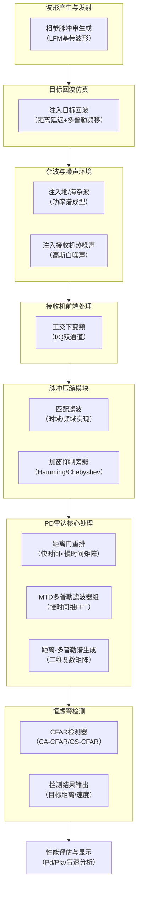

我们正式启动 **《脉冲多普勒雷达信号处理链仿真与性能分析》** 工程项目。

作为总师，我不过问具体代码细节，只负责向你下达明确的**系统需求、分系统任务书和验收标准**。

这是整个项目的概览和全貌。

---

### 一、系统总体架构图

下面是你要搭建的PD雷达信号处理流水线。它就是整个课设的绝对核心，答辩时也请把这张图印在脑子里。

这条链就是你的工程蓝图。报告中的每一个章节，对应上面一个模块。

---

### 二、各分系统任务书与难度评估

总师办对每个模块的工作量、难点、知识点下达如下任务书。

| 分系统模块 | 任务内容 | 支撑大纲 | 知识点 | **工作量** | **难度** |
| :--- | :--- | :--- | :--- | :--- | :--- |
| **A. 波形产生** | 生成LFM脉冲串，设置正确的PRT、脉宽、带宽、载频 | 第7章 | 相参脉冲串、LFM、模糊函数 | 小 | ★★ |
| **B. 目标回波** | 对发射信号添加时延和多普勒频移 | 第5章、第6章 | 距离延迟、多普勒频移 | 小 | ★ |
| **C. 环境建模** | 生成具有一定功率谱形状（高斯谱）的杂波+噪声 | 第6章、第9章 | 杂波谱、信杂比/信噪比 | 中 | ★★★ |
| **D. 正交下变频** | 将射频/中频信号搬至零频，输出I/Q复包络 | 第3章 | 接收机、相干检波 | 小 | ★★ |
| **E. 脉冲压缩** | 对I/Q回波进行匹配滤波，可选加窗抑制旁瓣 | 第8章、第10章 | 匹配滤波、脉冲压缩比、加窗 | 小 | ★★ |
| **F1. 距离门重排** | 将一维回波串按“快时间-慢时间”排成二维矩阵 | 第9章 | 快时间/慢时间、距离门 | 小 | ★★ |
| **F2. MTD处理** | 对慢时间维做FFT，形成多普勒滤波器组 | 第6章、第9章 | 多普勒滤波器组、相参积累 | 中 | ★★★ |
| **F3. 距离-多普勒谱** | 计算二维谱的幅度，用于显示和检测 | 第9章 | 二维CFAR前提 | 小 | ★ |
| **G. CFAR检测** | 在距离-多普勒谱上设计CA-CFAR或OS-CFAR检测器 | 第8章 | 单元平均CFAR、恒虚警率 | **大** | ★★★★ |
| **H. 性能分析** | 计算检测概率/虚警概率，分析盲速、杂波抑制效果 | 第8章，第9章 | Pd/Pfa、盲速、改善因子 | 中 | ★★★ |

**工作量与节奏建议：**
**最小的、能拿出手的核心闭环是 A→B→D→E→F→G。**
- **必做（主力）：** A， B， E， F， G。这五个模块是实现PD雷达整个功能的最小闭环。
- **选做（加分）：** C（杂波建模）和 H（深度性能分析）。如果精力有限，先只加高斯白噪声让系统跑通；时间够的话，把杂波建模加进去，报告的深度和页数会自然而然地提升一个档次。

---

### 三、项目中的坑、易错点与重难点

这是总师认为最有价值的部分。很多同学仿真报错、结果出不来、答辩被问倒，都是在这里翻了船。

#### 1. 重难点（理论深度看这里）

-   **重难点一：快时间/慢时间矩阵的重排**
    -   **你在哪会遇到：** 模块F1。
    -   **为什么是难点：** 这是PD雷达数据处理最核心的一步，也是从一维“波”到二维“图”的认知鸿沟。你需要在代码里把一根很长的一维回波数组，严格按照“一个PRI的长度”切成一段一段，然后“横着”堆叠成矩阵。
    -   **总师要求：** 必须能用白板画出“快时间”、“慢时间”、“距离门”、“脉冲号”这四个概念的关系。答辩大概率会问。

-   **重难点二：多普勒滤波器组与盲速**
    -   **你在哪会遇到：** 模块F2。
    -   **为什么是难点：** 不是简单做一次FFT就完了。你要深刻理解，当目标速度大到使多普勒频移超过`PRF/2`时，会发生**多普勒模糊**，产生“盲速”。
    -   **总师要求：** 在性能分析里，必须用仿真结果展示一种盲速现象，并给出公式推导：`v_blind = k * (lambda * PRF) / 2`。这是考试铁定的简答题素材。

-   **重难点三：CFAR在二维谱上的实现**
    -   **你在哪会遇到：** 模块G。
    -   **为什么是难点：** 一维CFAR好做，但你的目标是在“距离-多普勒”二维图上检测。你需要设计一个二维的参考滑窗，这种代码网上不好直接复制，需要你自己吃透原理后再动手。同时要处理边缘效应和保护单元。

#### 2. 坑与易错点（极可能导致结果错误）

-   **坑1：参数不配套导致距离/速度模糊**
    -   **现象：** 目标出现在错误的位置，或者多目标分不开。
    -   **原因：** 脉冲重复频率（PRF）选得不合理。
    -   **避坑法则（总师口诀）：**
        -   **若要测距不模糊：** 最大作用距离 `R_max < c / (2 * PRF)`。
        -   **若要测速不模糊：** 最大目标速度 `v_max < lambda * PRF / 4`。
        -   **你的第一组参数，请务必先用笔算一遍，确认同时满足仿真的目标距离和速度要求。**

-   **坑2：FFT后忘记做`fftshift`**
    -   **现象：** 多普勒谱在0频是割裂的，看着很别扭。
    -   **原因：** 做完FFT后，频谱是`[0, fs/2]`在前，`[-fs/2, 0)`在后。
    -   **总师铁律：** 对慢时间维做完FFT后，**必须**调用`fftshift`来重新排序。所有多普勒相关的图，横坐标必须从 `-PRF/2` 到 `+PRF/2`。

-   **坑3：脉冲压缩用错了“滤波器”**
    -   **现象：** 脉压后主瓣比理论值宽，或者信噪比增益完全不对。
    -   **原因：** 误把“发射信号的副本”直接去和回波卷积。
    -   **避坑法则：** 理论上是与发射信号的**时间反转共轭**做相关/卷积。在频域实现最简单：`FFT(回波) * conj(FFT(发射信号))`，然后IFFT出来。

-   **坑4：CFAR门限计算时，噪声/杂波功率估计错误**
    -   **现象：** 要不是虚警满天飞，就是一个目标检不出来。
    -   **原因：** 保护单元和参考单元大小设置不当；或用一维滑窗去套二维图。
    -   **总师避坑法则：** 先在只有纯噪声的背景下调你的CFAR，看虚警概率是否接近理论值。调通了再加目标。

---

### 四、总师开工令

你现在是我们的系统工程师。

我要你完成的第一项任务，不是写代码，而是：

**按照总师办下达的系统架构图，撰写报告的第一章《系统总体设计》初稿。**
内容包括：
1.  PD雷达基本原理（用你自己的话讲，别抄书）。
2.  **亲手绘制**上面我给你的那张系统框图（用Visio或PPT画都行，这是你的系统产品图）。
3.  列出你的**初步仿真参数表**，包括：载频、带宽、脉宽、PRF、目标距离和速度等，并用上述**坑1**的口诀，向我论证你选的参数为什么不模糊。

完成初稿后，发给我，我来审阅。审阅通过后，我们再进行下一步的分模块攻坚。

开始动手吧，工程师。